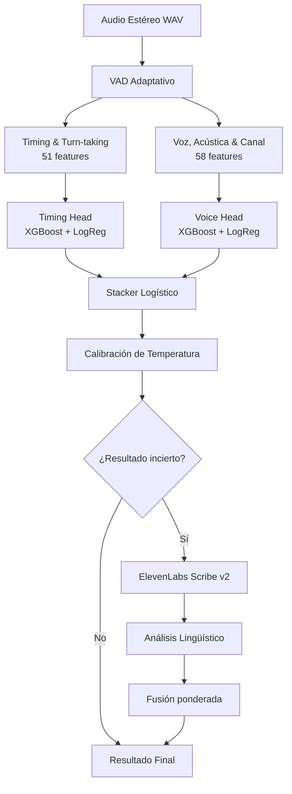
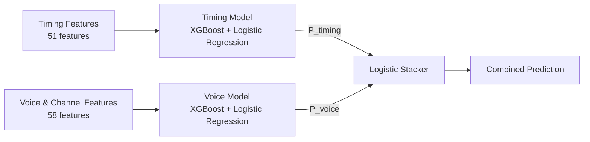
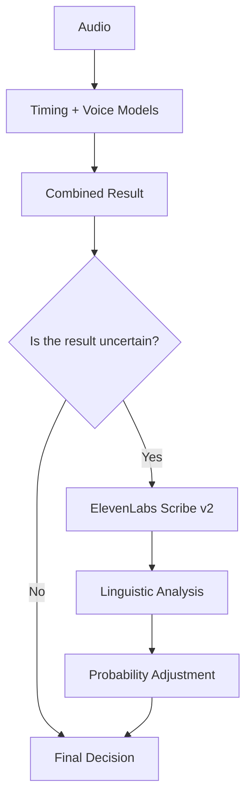

# Synthia AI Detector

> **Detección de llamadas humanas vs. IA en telefonía**
> Proyecto desarrollado para **HackMTY 2026 - Reto Altur**.

### API TEST LINK : https://governmental-hook-fill-instances.trycloudflare.com/detect

---

Memory Leak AI Detector recibe una llamada telefónica grabada y determina si la persona que llama es **humana o una IA**.

En lugar de intentar identificar únicamente si una voz “suena a IA”, el sistema analiza cómo se desarrolla la conversación, cómo se comporta la voz y cómo llega el audio por el teléfono.

En las **71 llamadas del conjunto de validación**, el sistema obtuvo:

- **100% Balanced Accuracy**
- **1.000 ROC-AUC**
- **0.0092 Brier Score**
- **71/71 llamadas clasificadas correctamente**

Este resultado es solo de el conjunto de validación disponible. **No significa que el modelo es perfecto en cualquier llamada.**

## Comandos

Python 3.11+. El audio debe estar en `audio/`.

```bash
python -m pip install -r requirements.txt
python -m src.train
python -m src.evaluate
uvicorn api.app:app --host 0.0.0.0 --port 8000
```

Para la tercera opinión (transcripción con ElevenLabs):

```bash
# Windows PowerShell
$env:ELEVENLABS_API_KEY="tu_clave"

# Linux / macOS
export ELEVENLABS_API_KEY="tu_clave"
```

Probar el endpoint con llamadas del dataset:

```bash
python scripts/check_endpoint.py --url http://127.0.0.1:8000/detect --split val
```

`POST /detect` recibe el WAV en base64 (`audio_base64`) y responde:

```json
{"is_synthetic": true, "confidence": 0.87}
```

## ¿Cómo funciona?

El sistema sigue un proceso escalonado:



La idea es utilizar varias señales independientes en lugar de depender de una sola.

# 1. El audio y la detección de turnos

Las llamadas son audio estéreo y contienen dos canales:

```text
Canal 0 → Caller
Canal 1 → Agente
```

Durante el desarrollo utilizamos los archivos de `turns/` como referencia para comprobar que la detección de voz fuera correcta.

En producción, el sistema **no necesita turnos precalculados**. Los obtiene directamente del WAV utilizando un VAD adaptativo.

### VAD adaptativo (Voice Activity Detection)

Para cada canal:

1. El audio se divide en ventanas de aproximadamente **20 ms**.
2. Se estima el piso de ruido mediante el **percentil 20**.
3. Se considera voz una señal aproximadamente **12 dB por encima del ruido**.
4. Se eliminan fragmentos demasiado cortos.
5. Se extienden los segmentos aproximadamente 100 ms para evitar cortar sonidos suaves.
6. Se unen pausas pequeñas de menos de aproximadamente 200 ms.

Esto genera los turnos para analizar la conversación:

```text
Caller: 12.4s → 15.1s
Agent:  15.3s → 18.0s
Caller: 20.1s → 22.4s
```

Durante la validación del VAD, se obtuvo aproximadamente:

- **0.95 IoU para caller**
- **0.97 IoU para agente**

comparando los segmentos detectados con las anotaciones de referencia.

Una vez obtenido el VAD, **el audio se procesa una sola vez** y se reutiliza para extraer todas las características.

---


# 2. Características del modelo

El modelo utiliza **109 características en total**:

```text
51 características de Timing
+
58 características de Voz y Canal
=
109 características
```

Estas características se dividen en dos grupos independientes.

---


## 2.1 Timing e interacción (Sección usando JSON)

Las características de timing intentan describir **cómo ocurre la conversación**.

Estas son las características usadas:

- Duración de los turnos.
- Número de turnos.
- Promedio, mediana y variación de las intervenciones.
- Tiempo de respuesta del caller.
- Variabilidad del tiempo de respuesta.
- Respuestas extremadamente rápidas o lentas.
- Tiempo de respuesta del agente.
- Pausas internas.
- Interrupciones.
- Solapamientos.
- Distribución temporal de la conversación.
- Porcentaje de tiempo hablado por cada lado.

### La latencia de respuesta

Una de las señales más importantes es:

> **¿Cuánto tarda el caller en comenzar a responder después de que termina el agente?**

Una IA de voz normalmente necesita pasar por varias etapas:

```text
    Audio
       ↓
 Speech-to-Text
       ↓
 Modelo de lenguaje
       ↓
 Text-to-Speech
       ↓
 Respuesta
```

Cada una puede introducir una pequeña cantidad de latencia. En los datos, las llamadas sintéticas presentan patrones diferentes a los humanos. Con eso ya calculamos si es humano o no.


*Los humanos se concentran en respuestas más rápidas y variables, mientras que las llamadas sintéticas presentan una distribución desplazada.*

---


## 2.2 Voz, acústica y canal (Sección de Audios)

La segunda cabeza analiza **cómo llega y cambia físicamente el audio**.

Se utilizan características relacionadas con:

- Piso de ruido.
- Energía de la señal.
- Relación señal/ruido.
- Silencios.
- Fugas entre canales.
- Pitch.
- Variación del pitch.
- Jitter.
- Shimmer.
- Variación del volumen.
- Energía por frecuencia.
- Centroide espectral.
- Ancho de banda.
- Cruces por cero.
- Variación de MFCC.
- Ritmo de habla.

### Características del canal

Una señal que usamos mucho es el **cross-talk**.

En una llamada telefónica física, parte de la señal del agente puede filtrarse hacia el canal del caller. Cuando una llamada es generada completamente por software, este comportamiento puede ser diferente.

También analizamos los **silencios digitales exactos**, donde existen segmentos con valores numéricos perfectamente iguales a cero.

Estas señales no se utilizan como reglas individuales, se combinan con el resto de características.

### Frecuencias altas

También analizamos la energía alrededor de la zona de **3.4 kHz** y otras propiedades espectrales.

La telefonía tradicional limita gran parte de la información de frecuencias altas, mientras que determinados sistemas sintéticos pueden generar patrones distintos en estas regiones.

### MFCC (Mel-frequency cepstral coefficients)

Los MFCC se utilizan principalmente para analizar **cómo cambia el timbre**, no para memorizar el timbre promedio de un individuo.

En lugar de depender únicamente del valor medio, se analiza su variabilidad. Esto ayuda a reducir la dependencia del modelo respecto a voces específicas del entrenamiento.


*Las distribuciones muestran diferencias entre llamadas humanas y sintéticas en diferentes propiedades acústicas y del canal.*

---


# 3. Arquitectura de los modelos

El sistema genera dos opiniones independientes:



Cada cabeza combina dos modelos complementarios:

### XGBoost

Utilizamos un XGBoost pequeño y regularizado para detectar:

- Relaciones no lineales.
- Umbrales.
- Interacciones entre características.

### Regresión logística

La regresión logística proporciona una decisión más suave y estable.


### Soft voting

Las dos predicciones se combinan para producir la probabilidad de cada cabeza.

---


# 4. El Stacker

Después de obtener las predicciones independientes, un tercer modelo las combina.

El **Stacker Logístico** recibe las probabilidades de:

```text
            Timing
              +
            Voice
              ↓
            Stacker
```

El stacker se entrena utilizando **predicciones Out-of-Fold de 5 folds**.

Esto es importante porque esto hace que no entrene al combinador utilizando predicciones que los mismos modelos utilizaron para aprender. En general, el sistema intenta evitar que el stacker aprenda siendo artificialmente optimista.


*Visualización de las predicciones en espacio logit y cómo las diferentes cabezas contribuyen a la decisión final.*

---


# 5. Calibración de confianza

Después del stacker se aplica una calibración de temperatura.

La calibración permite que una predicción como:

```text
0.99
```

no sea interpretada automáticamente como una certeza absoluta.

$$
T \geq 1
$$

Esto evita que el sistema incremente artificialmente probabilidades.

Además de mejorar la interpretación de la confianza, esto ayuda a obtener un mejor **Brier Score**.

# 6. Tercera opinión: Speech-to-Text

La mayoría de las llamadas pueden clasificarse solamente con las señales acústicas.

Por eso, la transcripción **no se utiliza para todas las llamadas**.

Primero se obtiene una decisión acústica.

Si el resultado es incierto y todavía existe suficiente tiempo disponible, el sistema puede pedir una tercera opinión.



La transcripción se realiza utilizando **ElevenLabs Scribe v2**.

El sistema busca señales como:

### Patrones humanos

Ejemplos:

```text
"mande"
"cómo?"
"perdón"
"a ver"
"este..."
```

También se consideran palabras cortadas, dudas y otras formas de respuesta espontánea.

### Patrones sintéticos

Se presta atención, entre otras cosas, a repeticiones demasiado exactas o inmediatas de información proporcionada por el agente.

### Peso limitado

La información lingüística **no reemplaza la predicción acústica**.

Su contribución tiene un peso menor:

Además, la transcripción tiene un presupuesto máximo de aproximadamente **12 segundos** para mantener controlada la latencia total.

---

# 7. ¿Por qué funciona?

La idea principal del proyecto es que una llamada sintética puede diferenciarse de una humana en más de una dimensión.

Ese proceso puede producir diferencias en:
- Tiempo de respuesta.
- Regularidad de los turnos.
- Variación del pitch.
- Variación del volumen.
- Espectro.
- Ruido.
- Propiedades del canal.
- Forma de las pausas.
- Forma en que responde a información del agente.

El modelo intenta combinar todas estas señales.

En pruebas internas, incluso eliminando dos de las señales más fuertes —**latencia de respuesta y bandas espectrales**— el modelo mantiene aproximadamente **97% de rendimiento en validación en** `train`.

Esto dice que el modelo no depende completamente de una sola regla.

---

# 8. Datos y validación

El entrenamiento utiliza únicamente las llamadas del split `train`.

Actualmente el conjunto de entrenamiento contiene aproximadamente:

```text
282 llamadas
├── 169 sintéticas
└── 113 humanas
```

El conjunto `val` se mantiene separado para evaluar el sistema.

Esto reduce el riesgo de que el modelo simplemente memorice las voces.

Los archivos dentro de `turns/` se utilizan como referencia para entrenar el modelo, pero **no son necesarios para clasificar una llamada nueva en producción**.

---


# 9. Resultados

En las **71 llamadas de validación** disponibles:


| Modelo            | Balanced Accuracy | ROC-AUC    | Brier Score |
| ----------------- | ----------------- | ---------- | ----------- |
| Timing Head       | 94.5%             | 0.9902     | 0.0541      |
| Voice Head        | 100.0%            | 1.0000     | 0.0094      |
| Fused Model       | **100.0%**        | **1.0000** | **0.0092**  |
| Pipeline completo | **100.0%**        | **1.0000** | **0.0092**  |


Esto representa:

```text
71 llamadas
71 correctas
0 incorrectas
```

El stacker tuvo que resolver discrepancias entre las dos cabezas en aproximadamente **2.8% de las llamadas**, equivalentes a 2 de 71.

En este conjunto de validación, ninguna llamada terminó necesitando el desempate lingüístico (usar ElevenLabs) porque las señales fueron suficientemente claras.


*Resultados del modelo*