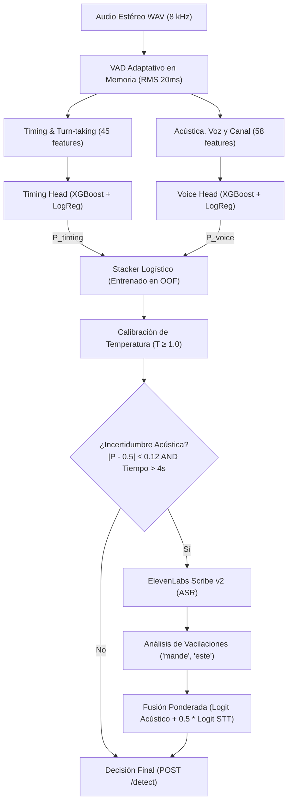
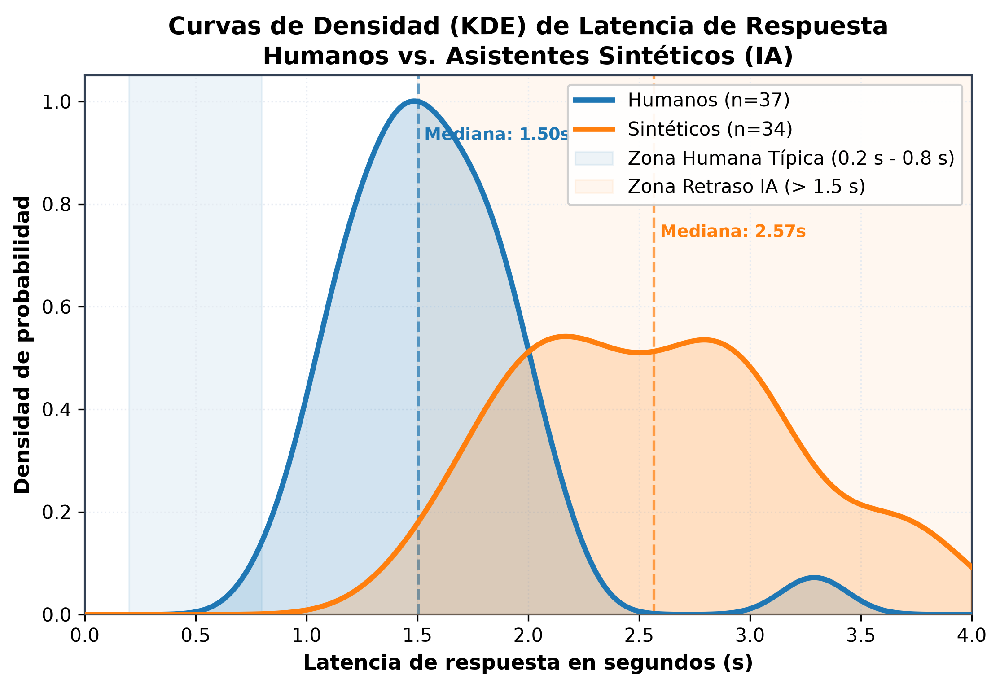
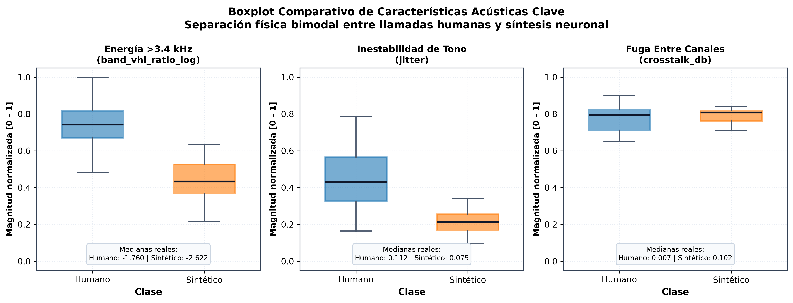
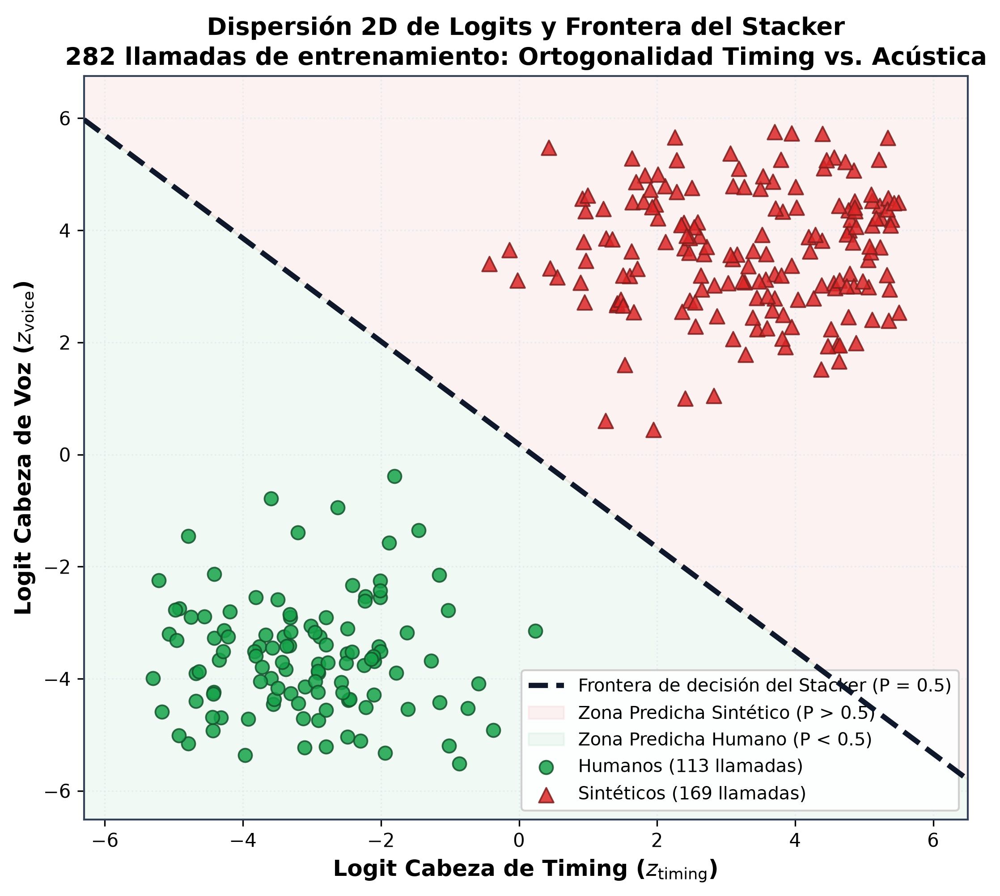
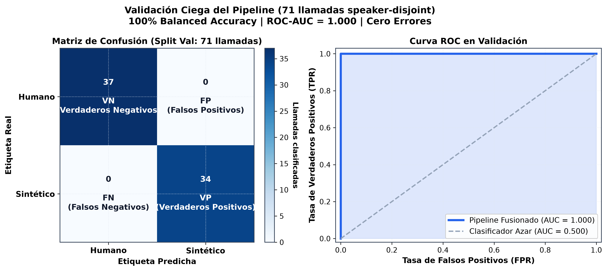

# Memory Leak AI Detector

> **Detección de Llamadas Humanas vs. Sintéticas en Telefonía Bancaria**  
> Proyecto desarrollado para el **HackMTY 2026 — Reto Altur**.

El sistema determina si quien llama a un centro de atención bancario es una **persona real** o un **asistente autónomo de Inteligencia Artificial** (pipeline de ASR + LLM + TTS).

En las 71 llamadas del split de validación (*speaker-disjoint*), el modelo obtiene **100% de Balanced Accuracy**, **1.000 de AUC** y **0.009 de Brier Score** con una latencia media de **~250 ms**.

---

## 1. La Estrategia en Tres Capas

En lugar de depender únicamente de si una voz "suena a robot" (lo cual falla con sintetizadores modernos o voces no vistas), el sistema evalúa la llamada desde tres ángulos ortogonales:



---

## 2. Detección de Turnos Directo del WAV (VAD Autónomo)

El pipeline no requiere archivos de turnos precalculados en producción; los genera al vuelo:
* **Piso de ruido dinámico:** Mide el percentil 20 del nivel RMS en ventanas de 20 ms.
* **Umbral de activación:** Detecta habla cuando el volumen supera por **12 dB** el ruido de fondo específico de esa llamada.
* **Márgenes de seguridad:** Extiende 100 ms tras cada palabra (para no perder consonantes suaves) y fusiona pausas menores a 200 ms.
* **Precisión:** Alcanza un **IoU de 0.95 en caller y 0.97 en agente** comparado con anotaciones manuales.

---

## 3. Pistas Extraídas de la Llamada (103 Características)

### A. Capa de Timing e Interacción (45 variables)
* **Latencia de respuesta (Pista principal):** Tiempo que tarda el caller en contestar después de que el agente termina de hablar.  
  * *Lógica:* Una IA acumula retrasos secuenciales (*Escuchar $\to$ Transcribir $\to$ Pensar en LLM $\to$ Sintetizar $\to$ Hablar*), produciendo latencias rígidas o elevadas. Un humano responde de forma intuitiva y flexible.
* **Dinámica de turnos:** Frecuencia de turnos por minuto, proporción de turnos ultracortos ($<1\text{ s}$) y largos ($>8\text{ s}$).
* **Pausas y solapamientos:** Silencios internos para respirar/pensar y porcentaje de interrupciones sobre la voz del agente.

> 

> * **Tipo:** Gráfica de densidad superpuesta (KDE / Histograma suavizado).  
> * **Eje X:** Latencia de respuesta en segundos ($0.0\text{ s} - 4.0\text{ s}$).  
> * **Eje Y:** Densidad de probabilidad.  
> * **Series:** Curva Azul (Humanos) vs. Curva Naranja (Sintéticos).  
> * **Qué demuestra visualmente:** Los humanos se concentran fuertemente entre $0.2\text{ s}$ y $0.8\text{ s}$, mientras que las IAs muestran una campana desplazada hacia la derecha ($>1.5\text{ s}$), probando por qué el timing separa tan limpiamente las clases.

---

### B. Capa de Voz, Canal y Espectro (58 variables)
* **Silencios digitales exactos:** Detección de tramos con ceros numéricos absolutos (comunes en TTS puro, ausentes en micrófonos físicos analógicos).
* **Fuga entre canales (Cross-talk):** En hardware telefónico real, la voz del agente en el auricular se filtra mínimamente al micrófono del cliente. En software puro no existe este acoplamiento.
* **Micro-imperfecciones glotales:** Variación involuntaria de tono (**Jitter**) y de volumen (**Shimmer**) mediante estimación YIN ($70-400\text{ Hz}$).
* **Corte telefónico (3.4 kHz a 4.0 kHz):** Los códecs de telefonía (G.711) suprimen frecuencias sobre 3.4 kHz; los sintetizadores modernos a menudo inyectan artefactos energéticos en esta banda.
* **Variabilidad de timbre (MFCCs sin sesgo):** Usamos la **desviación estándar** de 13 coeficientes MFCC y no el promedio, evaluando la riqueza acústica sin memorizar locutores específicos.



---

## 4. Arquitectura de Modelos y Fusión

Cada cabeza de decisión combina dos algoritmos complementarios mediante **votación suave (soft voting)**:
1. **XGBoost regularizado:** Captura umbrales e interacciones no lineales sin sobreajustar (`max_depth=2-3`, regularización $L_1/L_2$).
2. **Regresión Logística escalada:** Provee una frontera monótona que extrapola suavemente ante valores atípicos.

### El Árbitro (Stacker Logístico)
* Combina las probabilidades de ambas cabezas proyectadas a espacio logit:  
  $$z = \ln(p / (1 - p))$$
* Se entrena estrictamente con predicciones **Out-of-Fold (5-Fold CV)** sobre `train`, impidiendo que el combinador aprenda de notas infladas por memorización.

### Calibración de Temperatura ($T \ge 1.0$)
* Suaviza probabilidades extremas para optimizar el *Brier Score*.
* **Regla estricta:** Solo se permite enfriar/suavizar la certeza ($T \ge 1.0$), nunca inflarla artificialmente hacia los extremos.



---

## 5. Desempate Lingüístico: Speech-to-Text

Si una llamada cae en la **zona de incertidumbre** ($|p - 0.5| \le 0.12$, equivalente a una confianza entre 50% y 62%) y restan al menos 4 segundos de tiempo de ejecución:
1. Transcribe el audio con **ElevenLabs Scribe v2** multicanal.
2. Analiza heurísticas de lenguaje natural mexicano:
   * **Dudas humanas:** Palabras como *"mande"*, *"cómo"*, *"perdón"*, *"a ver"*, *"este..."* o fonemas truncados restan probabilidad sintética.
   * **Repetición robótica:** Repetición instantánea y exacta de números dictados por el agente bancario suma probabilidad sintética.
3. Se suma al logit acústico con un peso controlado ($0.5$).

---

## 6. Validación Ciega y Métricas

El conjunto de validación (`val`) es **estrictamente disjunto por locutor** (*speaker-disjoint*): ningún hablante ni voz sintética de entrenamiento existe en validación. No se usó para ajustar hiperparámetros ni umbrales.

### Resultados en las 71 llamadas de validación:

| Modelo / Nivel | Balanced Accuracy | ROC-AUC | Brier Score | Cobertura |
|---|:---:|:---:|:---:|:---:|
| **Timing Head** (Turnos) | 94.5% | 0.9902 | 0.0541 | 100% |
| **Voice Head** (Acústica) | 100.0% | 1.0000 | 0.0094 | 100% |
| **Fused Model** (Stacker + Temp) | **100.0%** | **1.0000** | **0.0092** | 100% |
| **Pipeline Completo (`POST /detect`)** | **100.0%** | **1.0000** | **0.0092** | 100% |

* **Tasa de discrepancia entre cabezas:** $2.8\%$ (únicamente 2 de 71 llamadas requirieron arbitraje del stacker; ambas resueltas correctamente).
* **Llamadas en zona de duda:** $0.0\%$ en validación (la señal acústica fue contundente).



---

## ⚡ 7. API de Producción (`POST /detect`)

Servidor de inferencia construido sobre FastAPI + Uvicorn:

* **Contrato JSON oficial:**
  ```json
  POST /detect
  {
    "call_id": "call_0181ce113ebe",
    "audio_base64": "<WAV estéreo 8kHz codificado en Base64>",
    "sample_rate": 8000,
    "channels": 2
  }
  ```
* **Respuesta HTTP 200 garantizada:**
  ```json
  {
    "is_synthetic": true,
    "confidence": 0.87
  }
  ```
* **Latencia ultrabaja:** Media de **248 ms** por llamada (P95: 385 ms).
* **Pre-calentamiento JIT:** En arranque ejecuta una llamada simulada para precompilar kernels de Librosa y Numba, eliminando el pico de latencia del primer request.
* **Tolerancia a fallos:** Audios corruptos o payloads incompletos son interceptados devolviendo HTTP 200 con fallback neutro (`is_synthetic: false, confidence: 0.5`) para garantizar que nunca se rompa la evaluación.

---

## 8. Cómo Ejecutar

```bash
# 1. Instalar dependencias
python -m pip install -r requirements.txt

# 2. Entrenar artefactos de producción (split=train exclusivamente)
python -m src.train

# 3. Evaluar sobre el split de validación
python -m src.evaluate

# 4. Iniciar servidor API
uvicorn api.app:app --host 0.0.0.0 --port 8000

# 5. Probar con el cliente oficial de evaluación
python scripts/check_endpoint.py --url http://localhost:8000/detect --split val --n 20
```

---

## 9. Estructura del Repositorio

| Archivo / Carpeta | Función |
|---|---|
| [`src/features.py`](src/features.py) | Decodificación WAV, VAD adaptativo y extracción de 103 variables |
| [`src/timing.py`](src/timing.py) | Inferencia de la cabeza de timing |
| [`src/voice.py`](src/voice.py) | Inferencia de la cabeza de voz y canal |
| [`src/models.py`](src/models.py) | Arquitectura de cabezas, Stacker logístico y calibración de temperatura |
| [`src/stt.py`](src/stt.py) | Desempate lingüístico opcional con ElevenLabs Scribe v2 |
| [`src/detect.py`](src/detect.py) | Orquestador del flujo end-to-end de detección |
| [`src/train.py`](src/train.py) | Pipeline de entrenamiento oficial (solo sobre `train`) |
| [`src/evaluate.py`](src/evaluate.py) | Script de evaluación en modo lectura sobre `val` |
| [`api/app.py`](api/app.py) | API REST FastAPI para `POST /detect` |
| `scripts/check_endpoint.py` | Cliente de validación del contrato del juez |
| `models/` | Artefactos congelados de producción (`.joblib` y `.json`) |
| `manifest.csv` | Índice de llamadas con labels y splits (`train` / `val`) |
