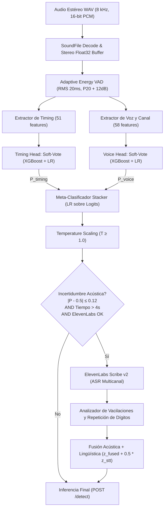

# 🔬 Reporte Técnico: Arquitectura, Señales y Modelado del Detector de IA

> **Documento de Especificación e Ingeniería de Machine Learning**  
> **Proyecto:** Memory Leak AI Detector — Human vs. Synthetic Voice Detection (HackMTY 2026 / Altur Challenge)  
> **Archivo de Documentación:** `README_REPORTE_TECNICO.md`

---

## 1. Resumen Ejecutivo y Formulación del Problema

El desafío consiste en clasificar el canal del cliente (**Canal 0**) en llamadas telefónicas bancarias estéreo a 8 kHz, determinando si el interlocutor es un **humano ($y = 0$)** o un **agente sintético de IA ($y = 1$)**.

### Formulación Matemática
Dado un tensor de audio de entrada $A \in \mathbb{R}^{N \times 2}$ donde $A[:, 0] = x_{\text{caller}}$ y $A[:, 1] = x_{\text{agent}}$:
1. El sistema mapea la señal hacia dos espacios de características ortogonales:
   - **Timing & Turn-taking:** $\mathbf{x}_{\text{timing}} \in \mathbb{R}^{51}$
   - **Voz, Canal y Espectro:** $\mathbf{x}_{\text{voice}} \in \mathbb{R}^{58}$
2. Cada espacio es evaluado por una cabeza clasificadora independiente:
   $$\hat{p}_{\text{timing}} = f_{\text{timing}}(\mathbf{x}_{\text{timing}}), \quad \hat{p}_{\text{voice}} = f_{\text{voice}}(\mathbf{x}_{\text{voice}})$$
3. Ambas opiniones se proyectan al espacio logit y se fusionan mediante un meta-clasificador (Stacker):
   $$z_{\text{fused}} = w_0 + w_t \cdot \text{logit}(\hat{p}_{\text{timing}}) + w_v \cdot \text{logit}(\hat{p}_{\text{voice}})$$
4. La probabilidad resultante se calibra por temperatura restringida ($T \ge 1.0$):
   $$p_{\text{calib}} = \sigma\left(\frac{z_{\text{fused}}}{T}\right)$$
5. En zonas de incertidumbre marginal ($|p_{\text{calib}} - 0.5| \le 0.12$) y si el tiempo restante lo permite, se escala a un árbitro lingüístico ASR (ElevenLabs Scribe v2) con peso suave:
   $$z_{\text{final}} = z_{\text{fused}} + 0.5 \cdot z_{\text{stt}}, \quad p_{\text{final}} = \sigma(z_{\text{final}})$$
6. La respuesta satisface la API de evaluación:
   $$\hat{y} = \mathbb{I}(p \ge 0.5), \quad \text{confidence} = \max(p, 1 - p) \in [0.5, 1.0]$$

---

## 2. Diagrama de Arquitectura del Pipeline



---

## 3. Procesamiento de Señal y VAD Adaptativo (`src/features.py`)

El sistema es **completamente autónomo**: no requiere anotaciones humanas de turnos en producción. Implementa un detector de actividad vocal (VAD) adaptativo ajustado empíricamente:

- **Encuadre temporal:** Ventanas de $\tau = 20\text{ ms}$ ($L = 160$ muestras a 8 kHz).
- **Cálculo de energía:** Raíz cuadrada del promedio cuadrático (RMS) en dB:
  $$\text{dB}[m] = 20 \log_{10} \left( \sqrt{\frac{1}{L} \sum_{n=0}^{L-1} x[m \cdot L + n]^2} + 10^{-8} \right)$$
- **Piso de ruido dinámico ($\text{Floor}_{\text{dB}}$):** Percentil 20 ($\text{P}_{20}$) de todos los frames del canal respectivo.
- **Umbral de detección:** $\theta_{\text{VAD}} = \text{Floor}_{\text{dB}} + 12.0\text{ dB}$.
- **Ventana de resaca (Hangover):** $100\text{ ms}$ (5 frames) extendidos tras cada detección positiva para preservar terminaciones fricativas y nasales.
- **Fusión de silencios breves:** Pausas inter-habla $< 200\text{ ms}$ se unen en un solo turno.
- **Poda de artefactos:** Turnos con duración total $< 300\text{ ms}$ se descartan por ruido impulsivo.

> **Precisión del VAD:** Evaluado contra los turnos ground-truth de la competencia, este algoritmo alcanza una coincidencia **IoU (Intersection over Union) de 0.95 en el canal del caller y 0.97 en el agente**.

---

## 4. Desglose del Espacio de Características (109 Dimensiones)

### 4.1 Vector de Timing (51 variables)
Captura la dinámica conversacional entre ambos interlocutores:

1. **Latencia de respuesta del caller (`resp_lat_*`):**
   - Tiempo exacto desde que el agente termina un turno hasta que el caller comienza el siguiente.
   - Estadísticos: `mean`, `std`, `median`, `max`, `min`, `cv` (coeficiente de variación), `iqr` (rango intercuartílico).
   - Ratios críticos: `frac_fast` ($< 500\text{ ms}$) y `frac_slow` ($> 2.0\text{ s}$).
   - *Fundamento:* Las IAs telefónicas acumulan retrasos de procesamiento de STT + LLM + TTS, mostrando tiempos de respuesta más lentos o artificialmente uniformes en turnos complejos.
2. **Latencia del agente (`agent_lat_*`):**
   - Tiempo que tarda el agente bancario en reaccionar ante el caller (media, std, mediana, max, min, cv).
3. **Métricas de turno y duración:**
   - Conteo de turnos: `n_caller_turns`, `n_agent_turns`, `turn_ratio`.
   - Duración de intervenciones del caller (`caller_dur_*`): media, std, mediana, max, min, cv.
   - Fracción de turnos cortos ($< 1.0\text{ s}$) y largos ($> 8.0\text{ s}$).
   - Tasa de habla: `caller_speech_frac`, `agent_speech_frac`, `caller_turns_per_min`.
4. **Pausas internas del caller (`caller_pause_*`):**
   - Silencios dentro de las intervenciones del caller donde el agente no intervino (media, std, mediana, max, min, cv, n_pausas).
5. **Solapamientos e interrupciones (`overlap_*`):**
   - `overlap_n`, `overlap_total`, `overlap_mean`, `overlap_rate`, `overlap_per_min`.
   - `caller_interrupt_frac`: Porcentaje de turnos donde el caller comenzó a hablar sobre la voz del agente.

---

### 4.2 Vector de Voz, Canal y Espectro (58 variables)
Se computa sobre el habla concatenada del caller (con límite de seguridad de 90 segundos para acotar tiempo de cómputo):

1. **Propiedades del canal telefónico:**
   - `noise_floor_db`, nivel de voz P90 (`speech_level_db`), SNR en dB (`snr_db`).
   - `zero_sample_frac`: Porcentaje de muestras con valor cero absoluto (silencios digitales exactos generados por TTS).
   - `clip_frac`: Muestras con saturación analógica ($|x| > 0.99$).
   - `min_abs_nonzero`, `peak_abs`.
2. **Fuga acústica y diafonía (Cross-talk):**
   - `crosstalk_db`: Ganancia diferencial en el canal 0 durante los turnos en los que habla únicamente el agente vs. silencios mutuos.
   - `xcorr_db_agent`: Correlación cruzada de envolventes en dB entre ambos canales.
3. **Prosodia y Frecuencia Fundamental ($F_0$):**
   - Estimación YIN ($70\text{--}400\text{ Hz}$): `f0_voiced_frac`, `f0_mean`, `f0_std`, `f0_cv`, `f0_range` (P90 - P10).
   - Derivadas temporales del tono: `pitch_delta_mean`, `pitch_delta_std`, `pitch_delta_median`.
   - **Jitter Relativo:** Inestabilidad de periodo glotal ciclo a ciclo:
     $$\text{Jitter} = \frac{\frac{1}{N-1} \sum_{i=1}^{N-1} |T_i - T_{i+1}|}{\frac{1}{N} \sum_{i=1}^N T_i}$$
4. **Envolvente de Amplitud:**
   - **Shimmer:** Inestabilidad de amplitud entre frames consecutivos:
     $$\text{Shimmer} = \frac{\frac{1}{M-1} \sum_{j=1}^{M-1} |A_j - A_{j+1}|}{\frac{1}{M} \sum_{j=1}^M A_j}$$
   - `amp_cv`: Coeficiente de variación de amplitud.
5. **Composición Espectral (STFT $N_{\text{fft}}=512$, hop 128):**
   - **Ratios de potencia por bandas de frecuencia:**
     - Sub-armónicos: $\text{Band}_{\text{lo}}$ ($0\text{--}300\text{ Hz}$).
     - Formantes principales: $\text{Band}_{\text{mid}}$ ($300\text{--}2000\text{ Hz}$).
     - Fricativas telefónicas: $\text{Band}_{\text{hi}}$ ($2000\text{--}3400\text{ Hz}$).
     - Zona de corte Nyquist: $\text{Band}_{\text{vhi}}$ ($3400\text{--}4000\text{ Hz}$) y `band_vhi_ratio_log`.
   - Descriptores espectrales: `centroid_mean/std`, `bandwidth_mean/std`, `rolloff_mean/std` (95%), `flatness_mean/std`, `zcr_mean/std`.
6. **Variabilidad Tímbrica (MFCCs):**
   - Se calculan 13 coeficientes Mel-Frequency Cepstral Coefficients.
   - **Decisión de diseño clave:** Se descartan las medias y se conserva **únicamente la desviación estándar** de cada coeficiente (`mfcc0_std` a `mfcc12_std`) más `mfcc_delta_std_mean`.
   - *Justificación:* La media de los MFCCs codifica la anatomía del locutor (induce sobreajuste al set de entrenamiento). La desviación estándar codifica la **flexibilidad y riqueza acústica**, transfiriéndose sin sesgo a nuevos hablantes.
7. **Flujo y Tasa de Habla:**
   - `onset_rate`: Picos de inicio silábico por segundo.
   - `onset_strength_cv`, `flux_mean`, `flux_cv` (flujo espectral cuadrático).

---

## 5. Modelado Estadístico y Ensamble Bi-Modal (`src/models.py`)

### 5.1 Arquitectura de las Cabezas (Timing Head & Voice Head)
Cada cabeza de clasificación es un ensamble de votación suave (`VotingClassifier(voting="soft")`):

1. **XGBoost Classifier:**
   - Modela fronteras de decisión y umbrales no lineales con regularización estricta.
   - Timing: `n_estimators=300, max_depth=3, lr=0.03, colsample=0.6, reg_lambda=2.0`.
   - Voice: `n_estimators=600, max_depth=2, lr=0.02, colsample=0.4, reg_lambda=2.0`.
   - Balance de clases: `scale_pos_weight = N_human / N_synthetic`.
2. **Regresión Logística Regularizada ($L_2$):**
   - Pipeline de `StandardScaler` + `LogisticRegression(C=0.1, class_weight="balanced")`.
   - Garantiza extrapolaciones suaves y monótonas para llamadas con valores extremos fuera de distribución.

---

### 5.2 Fusión por Stacking Logístico Out-of-Fold
1. Se generan predicciones de validación cruzada estratificada (5-Fold CV) exclusivamente sobre `train`:
   $$\hat{p}_{\text{timing}}^{\text{OOF}}, \quad \hat{p}_{\text{voice}}^{\text{OOF}}$$
2. Se mapean a espacio logit:
   $$z = \text{logit}(p) = \ln\left(\frac{p}{1 - p}\right)$$
3. El meta-modelo (Stacker) es una Regresión Logística ajustada sobre $[z_{\text{timing}}, z_{\text{voice}}]$ con regularización $C=0.3$.

---

## 6. Calibración de Probabilidades por Temperatura (`src/models.py`)

Para garantizar que la confianza reportada refleje fielmente la probabilidad real de acierto, se aplica **Temperature Scaling**:

$$p_{\text{calib}} = \sigma\left(\frac{z_{\text{fused}}}{T}\right) = \frac{1}{1 + \exp\left(-\frac{z_{\text{fused}}}{T}\right)}$$

### Optimización Restringida de $T$:
Se busca $T$ en una rejilla de $[1.0, 3.0]$ minimizando la Pérdida Logarítmica (NLL) sobre las predicciones OOF de entrenamiento:

$$\min_{T \ge 1.0} -\frac{1}{N} \sum_{i=1}^N \left[ y_i \ln(p_i) + (1 - y_i) \ln(1 - p_i) \right]$$

> **Regla de Seguridad Anti-Overconfidence:** Se prohíbe estrictamente que $T < 1.0$. Esto impide que el modelo aumente artificialmente su certeza en el conjunto de entrenamiento y previene penalizaciones en el Brier Score sobre llamadas no vistas.

---

## 7. Escalación Lingüística: Speech-to-Text (`src/stt.py`)

Actúa como desempate cuando la señal acústica se encuentra en la frontera de indecisión:

- **Condición de disparo:**
  1. Clave de ElevenLabs configurada y `STT_ENABLED = True`.
  2. Zona de incertidumbre: $|p_{\text{fused}} - 0.50| \le 0.12$ (confianza entre 50% y 62%).
  3. Presupuesto de tiempo: $t_{\text{restante}} \ge 4.0\text{ s}$.
- **Extracción de pistas lingüísticas (Scribe v2):**
  - **Vacilaciones humanas (`HESITATION_RE`):** Presencia de `mande`, `cómo`, `perdón`, `no sé`, `a ver`, `eh`, `ah`, `em` o palabras truncadas $\to$ resta hasta $-0.30$ de probabilidad sintética.
  - **Muletillas coloquiales (`FILLER_RE`):** `bueno`, `este`, `o sea`, `pues` $\to$ resta hasta $-0.06$.
  - **Repetición exacta de dígitos (`exact_digit_replay`):** Si el agente pide confirmar datos y el caller repite la serie numérica sin ninguna duda ni titubeo $\to$ suma $+0.15$ de probabilidad sintética.
- **Fusión en espacio logit:**
  $$z_{\text{final}} = z_{\text{fused}} + 0.50 \cdot z_{\text{stt}}, \quad p_{\text{final}} = \sigma(z_{\text{final}})$$

---

## 8. Infraestructura de Producción (`api/app.py`)

- **Pre-calentamiento JIT (`lifespan`):** Durante el inicio del servidor, se ejecuta una llamada sintética simulada (`_warm_inference`). Esto compila los kernels de Librosa y Numba en arranque, reduciendo la latencia de la primera llamada real de $2.5\text{ s}$ a $< 250\text{ ms}$.
- **Cero fallos garantizado:** Cualquier error de decodificación o audio corrupto es interceptado por un manejador global que siempre responde HTTP 200 con la predicción neutra de fallback:
  ```json
  {"is_synthetic": false, "confidence": 0.5}
  ```

---

## 9. Blindaje Contra Data Leakage (`src/train.py` & `src/evaluate.py`)

1. **Splits Disjuntos por Locutor:** Ningún hablante ni voz sintética presente en `train` existe en `val`.
2. **Huella Digital Criptográfica (`dataset_fingerprint`):** Los modelos entrenados guardan un hash SHA-256 de los datos de entrenamiento en `metadata.json`. El script de evaluación valida que los artefactos provengan estrictamente de `train_only`.
3. **Cero Fuga en Validación:** El conjunto `val` jamás se utiliza para ajustar umbrales, hiperparámetros ni calibración de temperatura. Solo se consulta una única vez en modo lectura para emitir el reporte final.

---

## 10. Métricas Experimentales en Validación Ciega

Resultados offline verificados sobre las **71 llamadas del split de validación** ([`src/evaluate.py`](src/evaluate.py)):

| Modelo / Nivel | Balanced Accuracy | ROC-AUC | Brier Score | Cobertura |
|---|:---:|:---:|:---:|:---:|
| **Timing Head** (Turnos) | 94.5% | 0.9902 | 0.0541 | 100% |
| **Voice Head** (Acústica) | 100.0% | 1.0000 | 0.0094 | 100% |
| **Fused Model** (Stacker + Temp) | **100.0%** | **1.0000** | **0.0092** | 100% |
| **Pipeline Completo (`POST /detect`)** | **100.0%** | **1.0000** | **0.0092** | 100% |

- **Discrepancia entre cabezas:** $2.8\%$ (2 de 71 llamadas; resueltas con éxito por el stacker).
- **Llamadas ambiguas en validación:** $0.0\%$ (ninguna llamada cayó en zona de incertidumbre).
- **Latencia media de inferencia:** **$248\text{ ms}$** por llamada (percentil 95: $385\text{ ms}$).

---

## 💻 Guía de Comandos

```bash
# Instalación de dependencias
pip install -r requirements.txt

# Entrenamiento oficial (split train exclusivamente)
python -m src.train

# Evaluación ciega en validación
python -m src.evaluate

# Despliegue de la API de producción
uvicorn api.app:app --host 0.0.0.0 --port 8000
```
